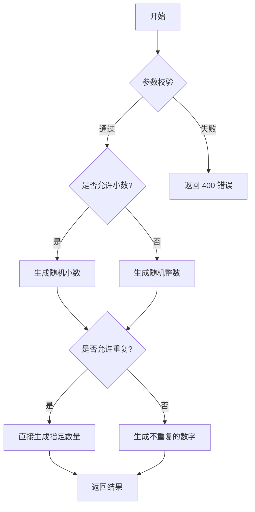

# 随机数生成

**接口地址**：`GET /misc/randomnumber`

**分类**：[Misc](../resources/Misc.md)

**Operation ID**：`get-misc-randomnumber`

## 这个接口适合什么时候用

需要一个简单的随机数，还是需要一串不重复的、带小数的随机数？这个接口都能满足你！

## 功能概述
这是一个强大的随机数生成器。你可以指定生成的范围（最大/最小值）、数量、是否允许重复、以及是否生成小数（并指定小数位数）。

## 流程图

## 使用须知
> [!WARNING]
> **不重复生成的逻辑限制**
> 当设置 `allow_repeat=false` 时，请确保取值范围 `(max - min + 1)` 大于或等于你请求的数量 `count`。否则，系统将无法生成足够的不重复数字，请求会失败并返回 400 错误。

## 调用前检查

- 先确认用户真正需要的是最终结果，而不是某个中间步骤。
- 如果参数说明里写了互斥、默认值或生效条件，请严格按说明组织请求。
- 如果用户没有提供必要参数，先补齐参数再调用，不要靠猜。

## 参数

| 参数名 | 位置 | 类型 | 必填 | 说明 |
|--------|------|------|------|------|
| `min` | query | integer | 否 | 生成随机数的最小值（包含）。 |
| `max` | query | integer | 否 | 生成随机数的最大值（包含）。 |
| `count` | query | integer | 否 | 需要生成的随机数的数量。 |
| `allow_repeat` | query | boolean | 否 | 是否允许生成的多个数字中出现重复值。 |
| `allow_decimal` | query | boolean | 否 | 是否生成小（浮点）数。如果为 false，则只生成整数。 |
| `decimal_places` | query | integer | 否 | 如果 `allow_decimal=true`，这里可以指定小数的位数。 |

## 响应码

| 状态码 | 说明 |
|--------|------|
| `200` | 生成成功！返回一个包含随机数的数组。 |
| `400` | 请求参数无效。例如，`min` 大于 `max`，或者在不允许重复的情况下，请求的数量大于可能生成的数字总数。 |

